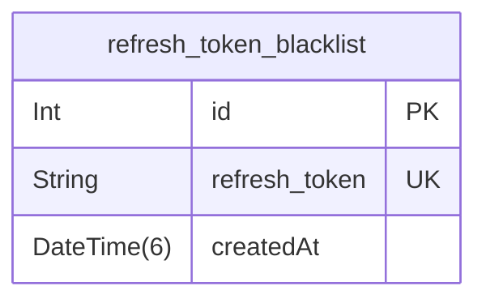

# Database ERD

> Generated by [`prisma-markdown`](https://github.com/samchon/prisma-markdown)

- [RefreshTokenBlackList](#refreshtokenblacklist)

## RefreshTokenBlackList

### `refresh_token_blacklist`

Refresh Token BlackList schema.

Properties as follows:

- `id`: Primary Key (AUTO_INCREMENT)
- `refresh_token`: Refresh-Token that stored in blacklist schema.
- `createdAt`: Creation time.
